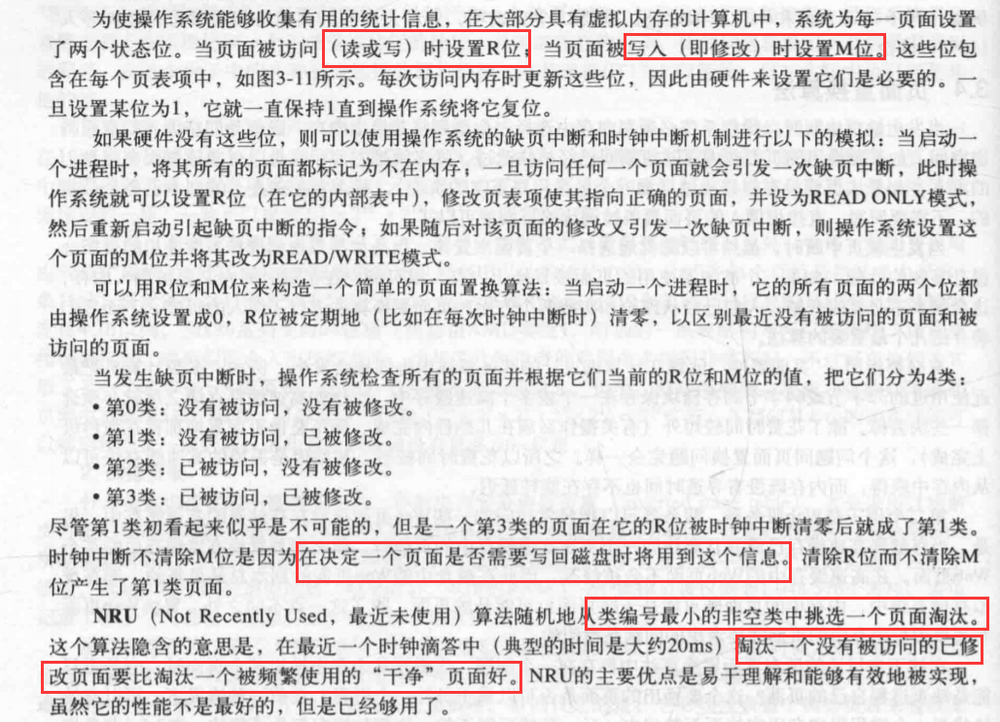

# 内存管理

1. 一种存储器抽象：地址空间
 
 - 直接将物理地址暴露给进程的问题：
 
 
 - 地址空间：进程用来寻址内存的一套地址集合，
 每个进程都有自己的地址空间，不同进程的地址空间原则上相互独立；
 
 - 基址寄存器和界限寄存器：基址寄存器存进程运行时程序的起始物理地址，
 界限寄存器存长须的长度。这样可以实现指令的动态重定位，但缺点是：
 每次访问内存都需要进行加法（基址寄存器的位置+相对位置）和比较（检查是否越界）运算，
 加法运算比较耗时；
 
2. 交换技术：

 - 交换：把空闲的进程存储到磁盘上去，交换会产生内部碎片，
 需要通过“内存紧缩”技术来减少内部碎片。
 
3. 空闲内存管理：

 - 使用位图的内存管理与使用空闲区链表的内存管理：
 
 
 - 内存分配算法：
 
 
4. 虚拟内存：

 - 分页：
 虚拟地址空间：
 
 MMU:
 
 
 - 页中断：当MMU发现当前的虚拟地址没有被映射到物理内存的时候，
 就会发生“页中断”，使CPU陷入到操作系统中，操作系统找到一个很少使用的页框，
 并将其写入到磁盘（如果它不在磁盘上），随后把需要访问的页面读到刚才
 被回收的页框，修改映射关系，然后重新启动引起陷阱的指令。
 
 - 虚拟地址的构成：页号+页内偏移量
 
 - MMU工作机制：
 
 
 
 - 页表结构：
 
 
 
 - 快表（TLB）：TLB快表本身的访问速度要快于对内存的访问，
 因此根据TLB查页框号，就要比去内存中根据页表查页框号要快。
 
 
 
 
 - 多级页表：为了避免把全部页表一直保存在内存中
 
5. 页面置换算法：

 - 最近未使用页面置换算法：
 
 
 - 先进先出页面置换算法；
 
 - 第二次机会页面置换算法：
 
 
 - 时钟页面置换算法：
 
 
 - LRU（最近最少使用页面置换算法）：
 
 
6. 分页系统中的设计问题：

 - 局部分配策略与全局分配策略：局部页面置换是淘汰同一个进程的页面，
 全局页面置换则是不区分进程地去淘汰页面；
 
 - 使用局部算法，即使有大量的空闲页框存在，
 工作集的增长也会导致颠簸（某个进程大量缺页），
 在使用全局算法时，系统必须不停确定应该给每个进程分配多少页框。
 
 - 内存映射文件：
 
 
 - 缺页中断处理：
 
 
 - 锁定内存中的页面：
 
 
 - 页框和磁盘的映射方案：
 
 
7. 分段：

 - 段页式：
 
 
 - 段页式寻址:
 
 
 
 
 