# 进程与线程

1. 进程的状态：
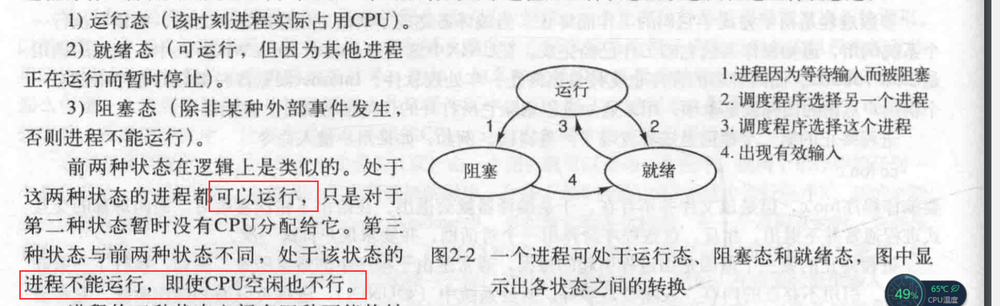

2. 进程控制表：
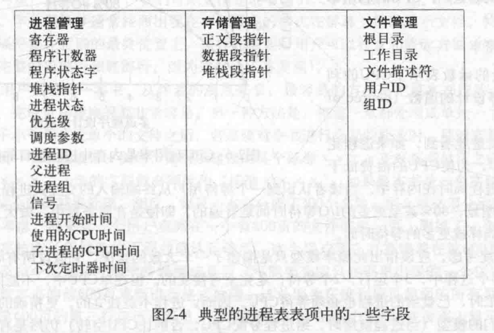

3. 中断执行步骤:
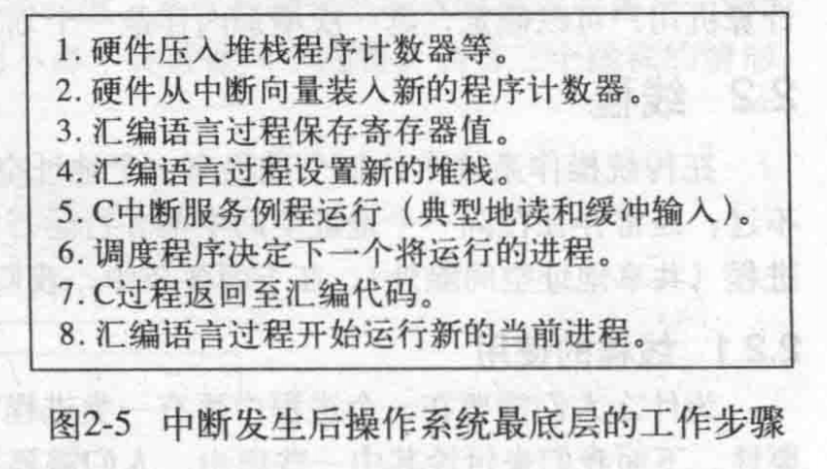

4. 进程VS线程:
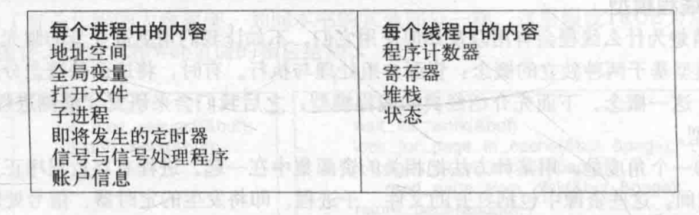

5. 每个线程都拥有自己的堆栈，即堆栈帧，
线程栈帧中存放了被调用但是还没从中返回的过程的局部变量，
以及过程调用完成后使用的返回地址。
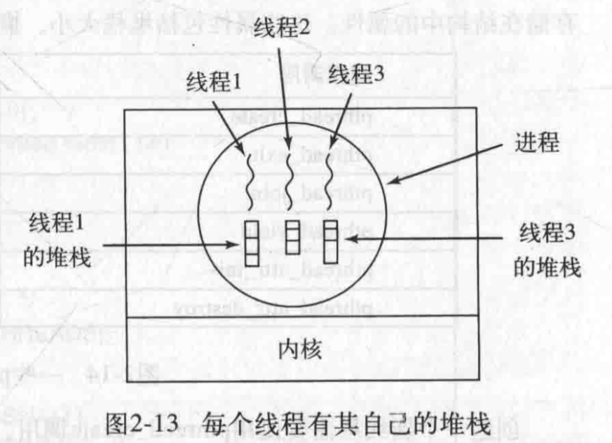

6. 用户级线程包VS内核管理的线程包：
在内核管理下的线程，如果一个线程阻塞了，内核根据其选择，
可以运行同一个进程中的另一个线程，或者运行另一个进程中的线程。
而在用户级线程中，运行时系统始终运行自己进程中的线程，
直到内核剥夺了该进程的CPU为止。（用户级，先进程，后线程；
内核级，由内核统一管理线程，线程是CPU调度的最小单位）。
但是，内核级线程的创建和删除需要陷入到系统调用，代价比较大。
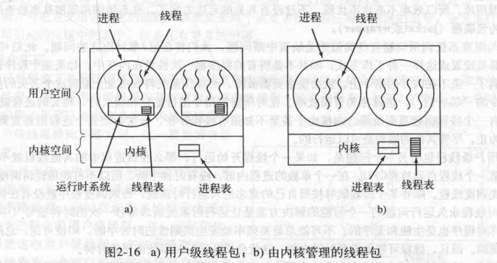

7. 进程间通信：
 - 避免竞争需要满足的条件：
 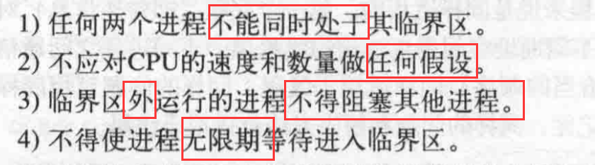
 
 - 严格轮换法：这种方法会导致线程被处于非临界区的线程阻塞
 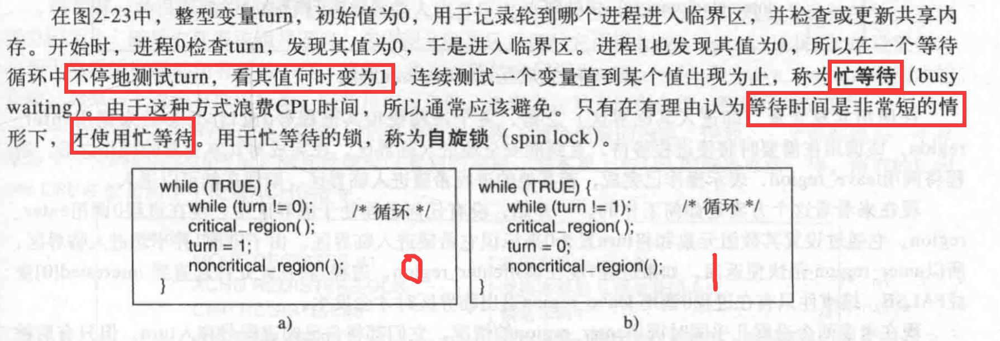
 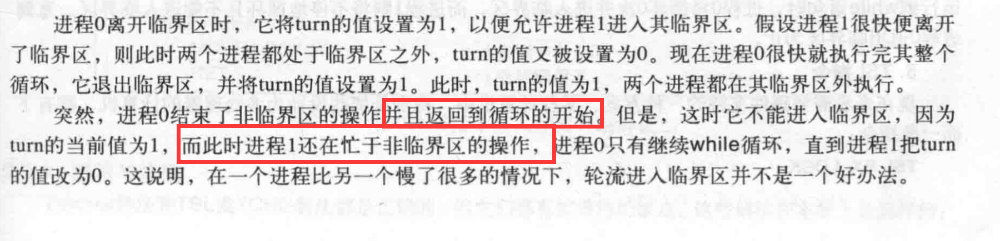
 
 - Peterson解法：注意图中框起来的，
 如果线程0和线程1同时想进入临界区，同时调用enter_region,
 则，数组的全部位置（0,1）均为true，但是公共变量turn只能
 是相对后面的线程对应的值。比如，当前turn为0，则线程0会进行
 忙等待，而线程1则可以进入临界区，当线程1离开临界区，调用leave_region
 后，interested[1]被置为false，此时，线程0就跳出循环，进入临界区。
 这样就可以保证， 线程只会被进入临界区的线程阻塞。
 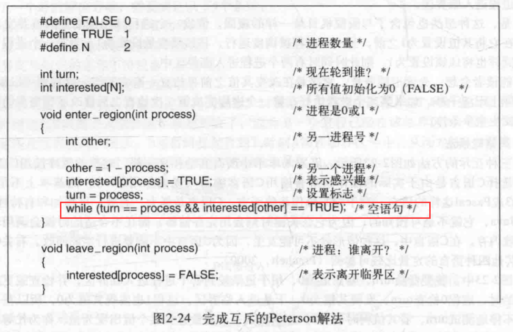
 
 - 优先级反转：
 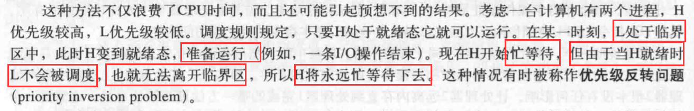
 
 - 生产者消费者问题（有界缓冲区问题）：
 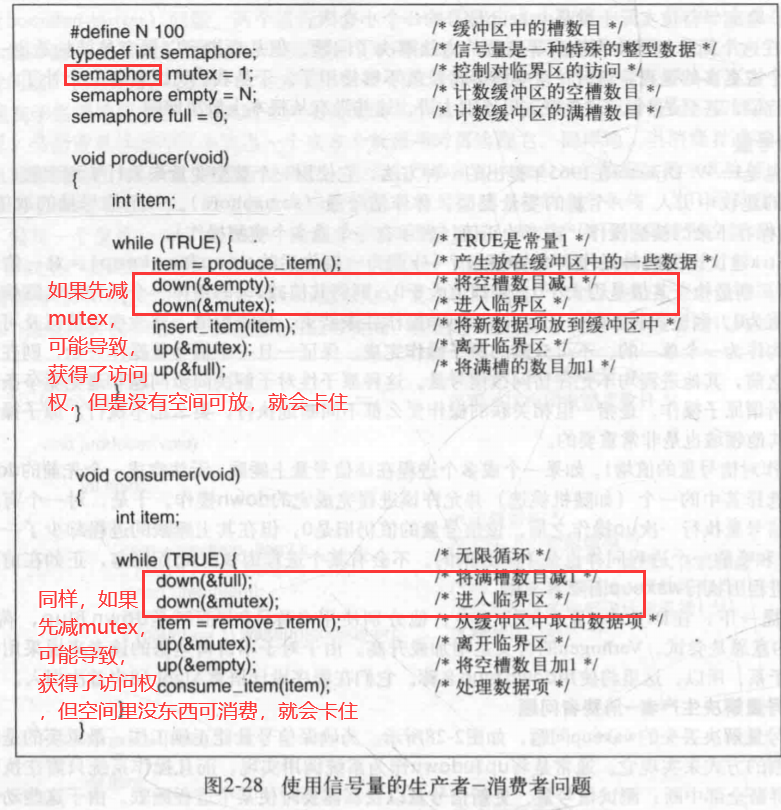
 
8. 调度：

 - 进程调度的时机：
 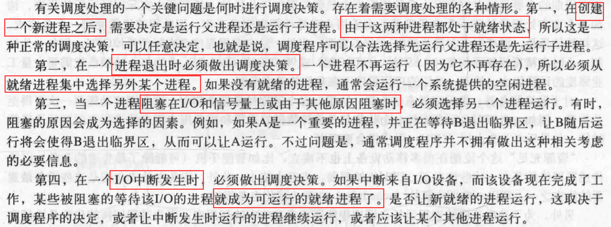
 
 - 不同环境中调度算法的目标：
 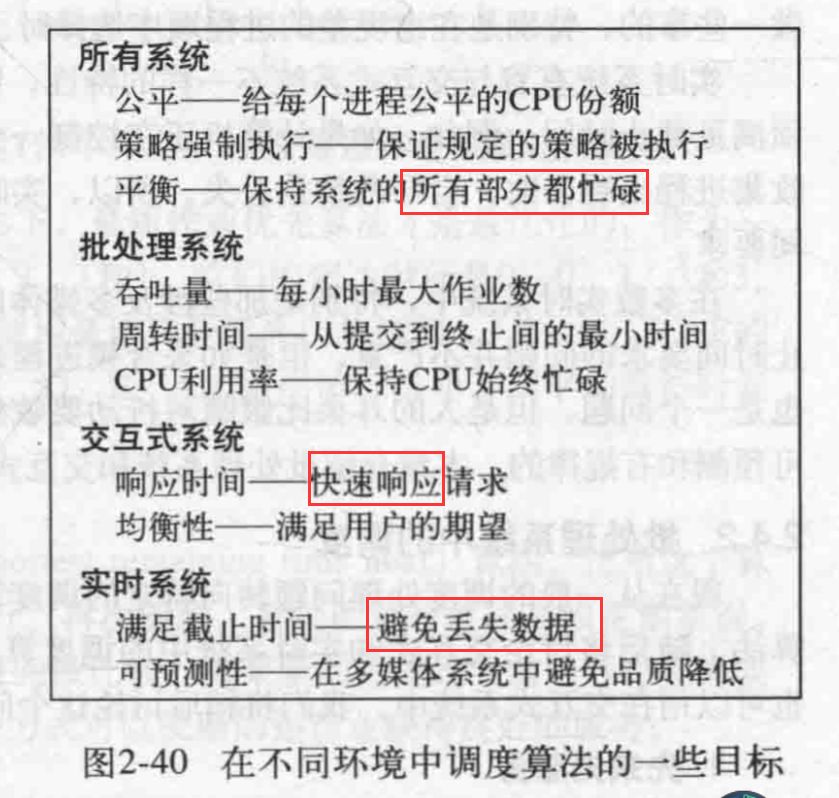
 
 - 先来先服务调度：优点：公平；
 缺点：不灵活，CPU密集型线程可能会被IO密集型长时间阻塞；
 
 - 最短作业优先调度：只有当所有的作业都可同时运行的情况下，
 最短作业优先算法才是最优化的（平均周转时间最短）
 
 - 最短剩余时间优先调度：最短作业优先调度算法的“抢占式”版本，
 调度程序总是选择剩余运行时间最短的那个进程运行。
 
 - 轮询调度：每个进程被分配一个时间片，允许该进程在这段时间内运行，
 进程的切换需要：保存和装入寄存器值及内存映像、更新各种表格和列表，
 清除和重新调入内存高速缓存（这部分开销是轮询调度的缺点之一），
 为了提高CPU的有效利用率，可以将时间片加长，但是，如果大多数进程所需
 的CPU时间都比较短的话，就会有很多的CPU时间的浪费。
 总结：时间片过短会导致过多的进程切换，降低CPU效率，
 时间片过长又可能一起对短交互请求的响应时间变长。
 
 - 优先级调度：分优先级，低优先级进程可能会“饿死”
 
 - 多级队列：
 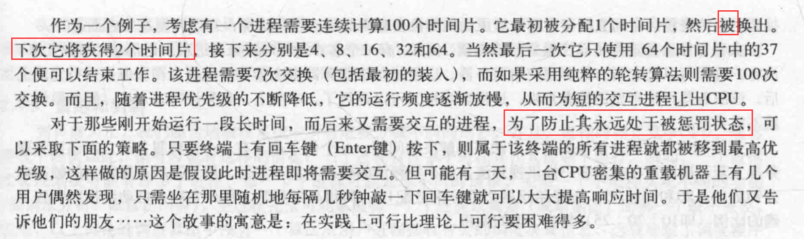
 
 - 经典的IPC问题（进程间同步）：
 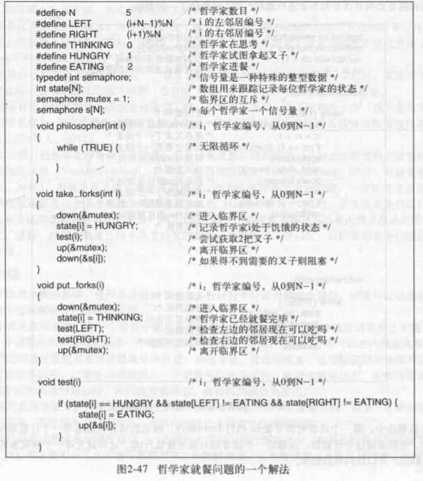
 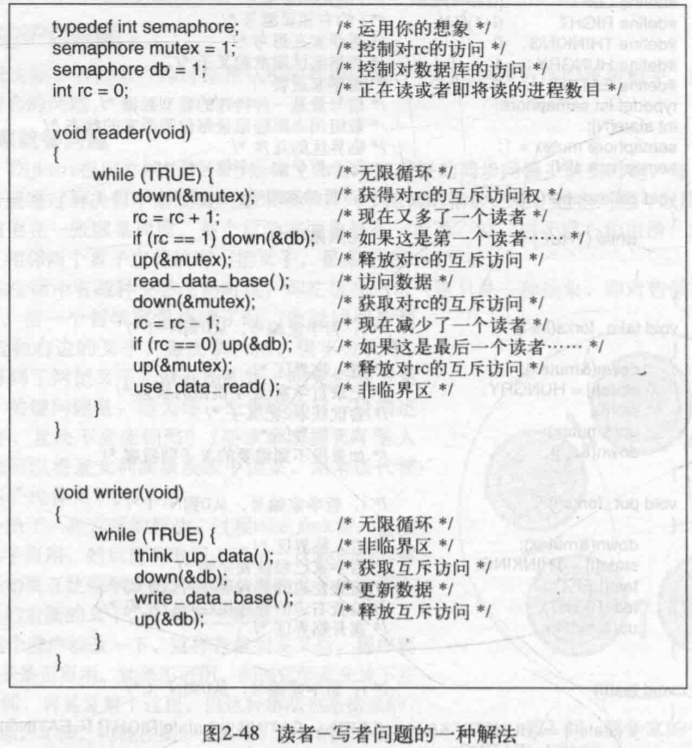
 
 
 
 

