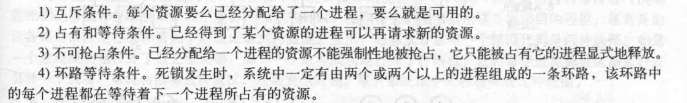
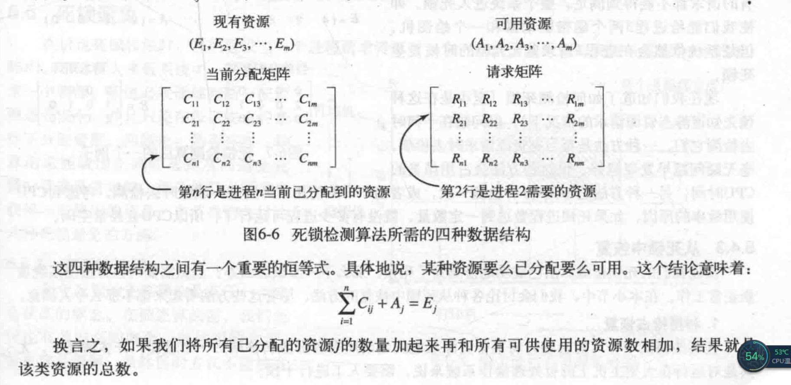
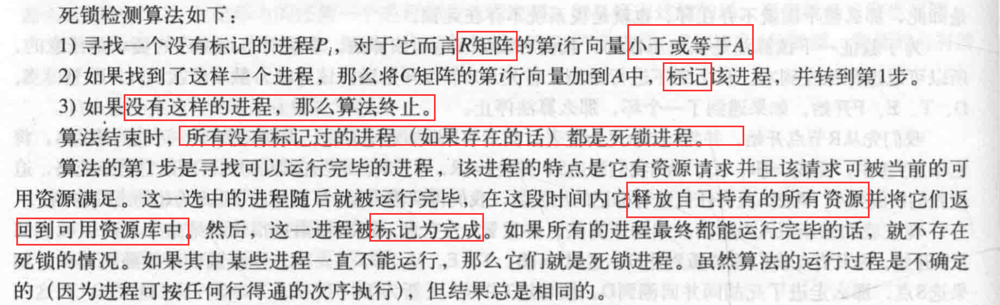
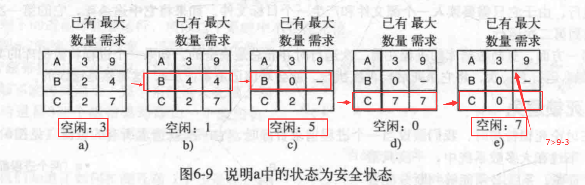
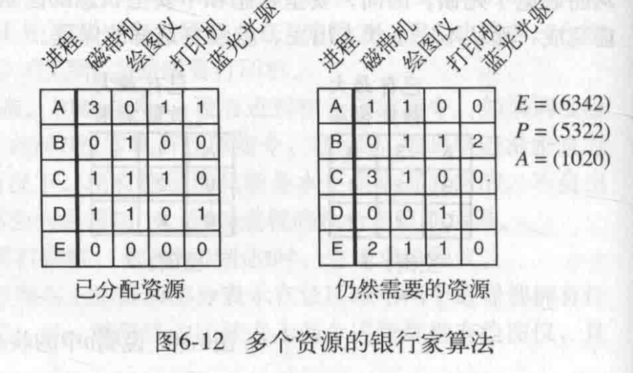
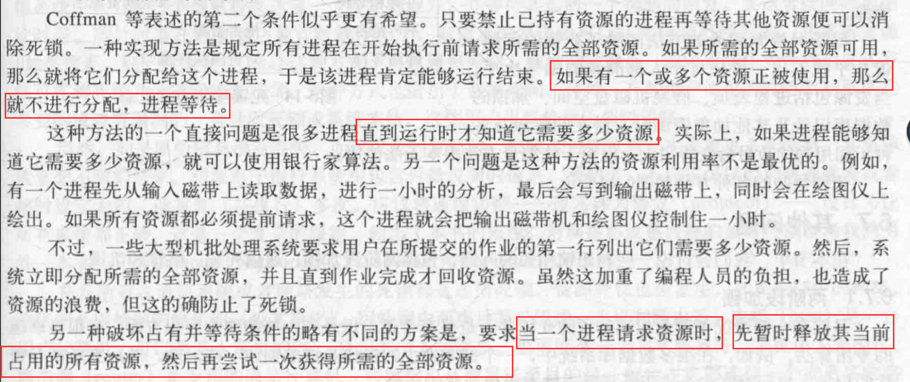
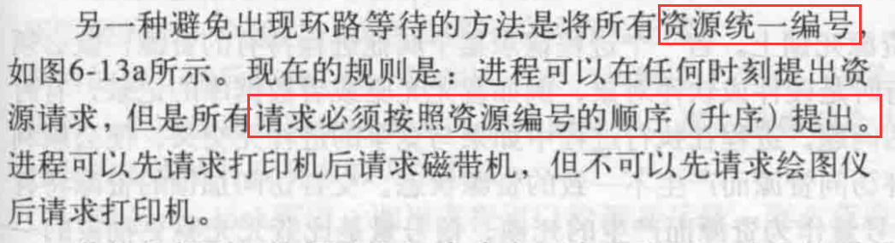

# 死锁

1. 死锁的规范定义：如果一个进程集合中的每个进程都在等待，
只能由该进程集合中的其他进程才能引发的事件，那么该进程结合就是死锁的。

2. 死锁的四个必要条件：

3. 死锁检测：
 - 死锁检测算法:
 

 - 死锁检测算法步骤:
 
 
4. 死锁恢复：

 - 利用抢占恢复：将某个进程挂起（挂起进程的选择取决于，
 哪个进程拥有比较容易收回的资源）；
 
 - 利用回滚恢复：将进程恢复到上一个检查点；
 
 - 通过杀死进程恢复；
 
5. 死锁避免：

 - 安全状态检测：
 
 
 - 银行家算法：对每一个请求进行检查，
 检查如果满足这一请求是否会达到安全状态，如果可以达到，
 那么就满足该请求，否则就推迟这一请求的满足。为了检查状态是否安全，
 银行家需要考虑他是否有足够的资源满足某一个客户，
 如果可以这笔贷款就是能够收回的，并且接着检查“最接近最大限额”的一个客户。
 以此类推。如果所有投资最终都能被收回，那么该状态是安全的。最初的请求可以批准。
 
 - 多个资源的银行家算法：
 
 
 
6. 死锁预防：

 - 破坏互斥条件：不采用，如果不同进程对资源的访问不互斥，
 那么就可能造成临界区资源访问的竞态问题；
 
 - 破坏占用并等待条件：
 
 
 - 破坏不可抢占条件；
 
 - 破坏环路等待条件：
 
 
 